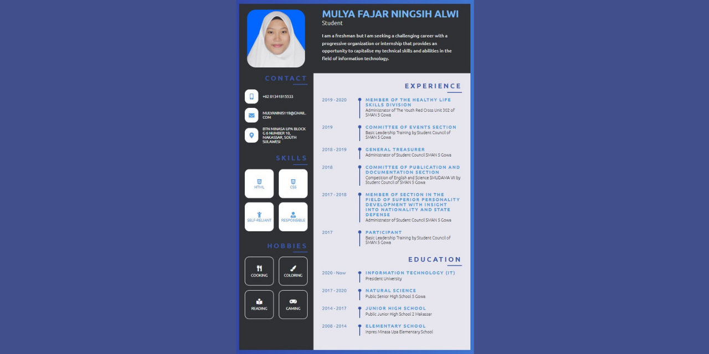

# Web-based Curriculum Vitae using HTML and CSS Programming Languages (Not the Recent CV)
This is a mid-term project of the Web Programming course. This was a web-based CV that I created using HTML and CSS programming languages as my mid-term examination in the Web Programming course it includes my profile, contact, skills, hobbies, experiences, and education, to view the CV, you may run the index.html file but to access this web-based CV is still using localhost.

